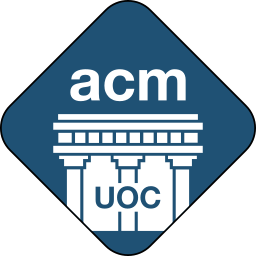
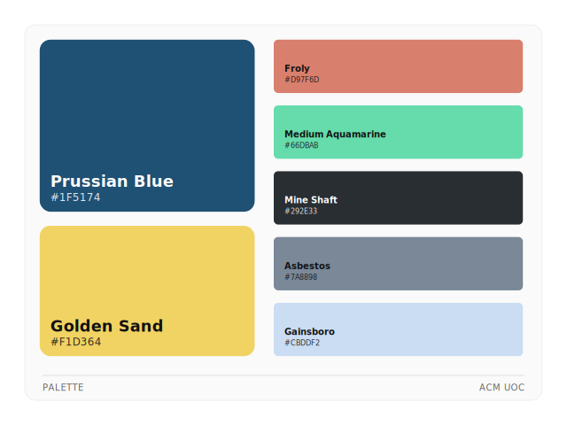

<div align="center">
  
  <h1>ACM UOC — Design Assets</h1>
  <p>Central repository for all ACM-UOC design assets in source formats (SVG, Inkscape, templates), including branding, event graphics, and reusable materials.</p>
</div>

---

## Folder Structure

```
acm-assets/
├── logos/                # Vector logos and rasterized variations
├── media/
│   ├── illustrations/    # Custom vector illustrations
│   ├── photography/      # Event and promotional photos
│   └── video/            # Video assets and motion graphics
├── templates/
│   ├── print/            # Posters, flyers, banners (PDF/SVG)
│   └── social-media/     # Instagram, LinkedIn, story templates
├── palette.svg           # Official color palette reference
└── README.md
```

---

## Color Palette

<div align="center">
  
</div>

---

## Asset Guidelines

### Formats

- **Always include a vector source file (SVG)** for any logo, illustration, or template. Raster-only assets are discouraged.
- Export **PNG raster variants** at the sizes needed for the target use case. Standard sizes for logos are: `64×64`, `128×128`, `256×256`, `512×512`, `1024×1024`.
- PDF exports are acceptable for print templates, in case providing an SVG is not an option.

### Naming

Use lowercase, hyphenated names. Include a size suffix for raster exports:

```
<asset-name>.svg
<asset-name>_64x64.png
<asset-name>_256x256.png
```

For variants (e.g. dark background, monochrome), add a descriptor before the size:

```
acm-uoc-mono.svg
acm-uoc-mono_256x256.png
acm-uoc-whitefill_256x256.png
```

---

## Contributing

1. Fork the repository and work on a branch using the asset category as prefix (e.g. `logo/acm-uoc-v2`, `template/event-poster-may-2025`, `media/workshop-photos-april-2025`).
2. Follow the naming conventions and format requirements above.
3. Open a pull request with a brief description of the asset and its intended use.
4. At least one maintainer must review before merging.

---

<div align="center">
  <sub>ACM UOC · University of Crete · <a href="https://github.com/ACM-UOC">github.com/ACM-UOC</a></sub>
</div>
