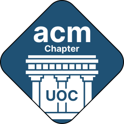
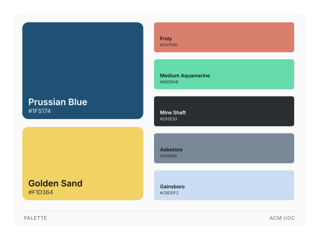

<div align="center">
  
  <h1>Design Assets</h1>
  <p><strong>University of Crete ACM Student Chapter</strong></p>
  <p>Central repository for our chapter's design assets in source formats, including branding, event graphics, and reusable materials.</p>
</div>

---

## Folder Structure

```
acm-assets/
├── logos/                # Vector logos and rasterized variations
├── fonts/                # Typefaces used across our assets
├── media/
│   ├── illustrations/    # Custom vector illustrations
│   ├── photography/      # Event and promotional photos
│   └── video/            # Video assets and motion graphics
├── templates/
│   ├── print/            # Posters, flyers, banners (PDF/SVG)
│   └── social-media/     # Instagram, LinkedIn, story templates
├── palette.svg           # Official color palette reference
└── README.md
```

---

## Color Palette

<div align="center">
  
</div>

---

## Fonts

Our assets use three typefaces, bundled under `fonts/` so designers can install them locally and have SVG text render correctly:

- **Inter** — sans-serif, used in the logo and most UI/branding.
- **Baskervville** — serif, for editorial or formal contexts.
- **Fira Mono** — monospace, for code snippets and technical material.

Each subfolder ships the variable font(s) where available (or static cuts otherwise) plus their license files. Install the `.ttf` files on your system before opening the SVG sources.

> [!WARNING]
> Editors like Inkscape silently fall back to a default font when the requested one isn't installed — no error, no prompt. The file will *look* fine on screen but any text you edit (or re-export) will use the wrong typeface. Always install the fonts above before touching an SVG that contains text.

---

## Asset Guidelines

### Formats

- **Always include a vector source file (SVG)** for any logo, illustration, or template. Raster-only assets are discouraged.
- Export **PNG raster variants** at the sizes needed for the target use case. Standard sizes for logos are: `64×64`, `128×128`, `256×256`, `512×512`, `1024×1024`.
- PDF exports are acceptable for print templates, in case providing an SVG is not an option.

### Attribution

Where possible, include a plain `CREDITS` file in the asset folder listing the original creator(s) and any subsequent contributors.

### Naming

Use lowercase, hyphenated names. Include a size suffix for raster exports:

```
<asset-name>.svg
<asset-name>_64x64.png
<asset-name>_256x256.png
```

For variants (e.g. dark background, monochrome), add a descriptor before the size:

```
acm-uoc-mono.svg
acm-uoc-mono_256x256.png
acm-uoc-whitefill_256x256.png
```

---

## Contributing

1. Fork the repository and work on a branch using the asset category as prefix (e.g. `logo/acm-uoc-v2`, `template/event-poster-may-2025`, `media/workshop-photos-april-2025`).
2. Follow the naming conventions and format requirements above.
3. Open a pull request with a brief description of the asset and its intended use.
4. At least one maintainer must review before merging.

---

<div align="center">
  <sub>University of Crete ACM Student Chapter · <a href="https://github.com/ACM-UOC">github.com/ACM-UOC</a></sub>
</div>
